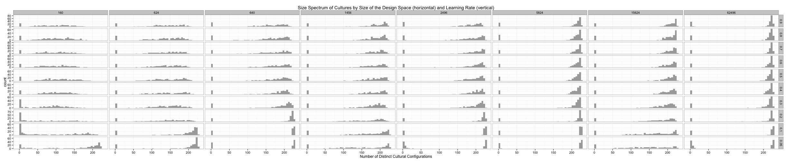
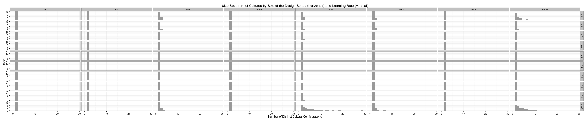
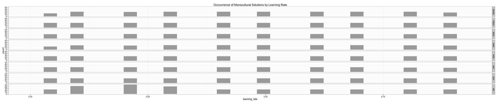
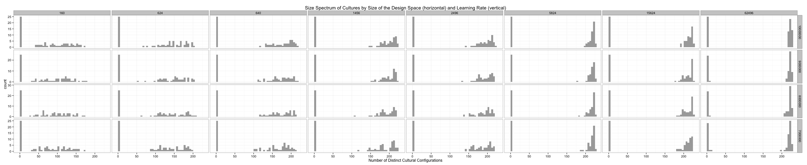

Is there a systematic relationship between the number of culture regions in a sample and the learning rate, at a given size design space?


```r


# THIS FIGURE IS USED IN THE SPRINGER PAPER

p <- ggplot(full_region_count, aes(x = num_culture_regions)) + geom_histogram(binwidth = 5, 
    fill = "darkgrey") + xlab("Number of Distinct Cultural Configurations") + 
    ggtitle("Size Spectrum of Cultures by Size of the Design Space (horizontal) and Learning Rate (vertical)")
p + facet_grid(learning_rate ~ size_trait_space, scale = "free_y", as.table = FALSE)
```

 

```r
ggsave("../paper/figure/size-spectrum-regions-saa12full.pdf", dpi = 300)

```


And, a subset which is small enough to be legible for the conference presentation:


```r


# THIS FIGURE IS USED IN THE CONF PAPER

p <- ggplot(confsubset_region_count, aes(x = num_culture_regions)) + geom_histogram(binwidth = 5, 
    fill = "#39275B") + xlab("Number of Distinct Cultural Configurations") + 
    ggtitle("Size Spectrum of Cultures by Size of the Design Space (horizontal) and Learning Rate (vertical)")
p + facet_grid(learning_rate ~ size_trait_space, scale = "free_y", as.table = FALSE)
```

 

```r
ggsave("../presentation/images/conf-size-spectrum-regions-saa12full.pdf", dpi = 300)

```


How does the mutation or innovation rate affect this?  First, without innovation:


```r
p <- ggplot(rc_noinnov, aes(x = num_culture_regions)) + geom_histogram(fill = "darkgrey", 
    binwidth = 1) + xlab("Number of Distinct Cultural Configurations") + ggtitle("Size Spectrum of Cultures by Size of the Design Space (horizontal) and Learning Rate (vertical)")
p + facet_grid(learning_rate ~ size_trait_space, scale = "free_y", as.table = FALSE)
```

 


And, with innovation:


```r

p <- ggplot(rc_innov, aes(x = num_culture_regions)) + geom_histogram(fill = "darkgrey", 
    binwidth = 5) + xlab("Number of Distinct Cultural Configurations") + ggtitle("Size Spectrum of Cultures by Size of the Design Space (horizontal) and Learning Rate (vertical)")
p + facet_grid(learning_rate ~ size_trait_space, scale = "free_y", as.table = FALSE)
```

 

```r

```


Now, let's look at the distribution of monocultural solutions:


```r

monocultural_both <- subset(full_region_count, num_culture_regions == 1)
p <- ggplot(monocultural_both, aes(x = learning_rate)) + geom_histogram(fill = "darkgrey") + 
    ggtitle("Occcurrence of Monocultural Solutions by Learning Rate")
p + facet_grid(size_trait_space ~ ., , as.table = FALSE)
```

 

```r

```


Time dependence?


```r

p <- ggplot(rc_by_time_0.9, aes(x = num_culture_regions)) + geom_histogram(binwidth = 5, 
    fill = "darkgrey") + xlab("Number of Distinct Cultural Configurations") + 
    ggtitle("Size Spectrum of Cultures by Size of the Design Space (horizontal) and Learning Rate (vertical)")
p + facet_grid(sample_time ~ size_trait_space, scale = "free_y", as.table = FALSE)
```

 


And we can look at the linear model.  We only have a few values of learning rate and innovation rate, but technically both are continuous variables, as is the response variable.  Here I look at the innovation set only.


```r
fit <- lm(num_culture_regions ~ learning_rate + innovation_rate + size_trait_space, 
    data = rc_innov)
summary(fit)
```


Call:
lm(formula = num_culture_regions ~ learning_rate + innovation_rate + 
    size_trait_space, data = rc_innov)

Residuals:
   Min     1Q Median     3Q    Max 
-72.24 -13.13   3.36  16.96  43.43 

Coefficients:
                  Estimate Std. Error t value Pr(>|t|)    
(Intercept)       3.99e+01   6.83e-01    58.5  < 2e-16 ***
learning_rate    -4.43e+00   6.91e-01    -6.4  1.6e-10 ***
innovation_rate   3.34e+05   7.56e+03    44.2  < 2e-16 ***
size_trait_space  5.73e-04   9.82e-06    58.3  < 2e-16 ***
---
Signif. codes:  0 '***' 0.001 '**' 0.01 '*' 0.05 '.' 0.1 ' ' 1

Residual standard error: 22.4 on 14088 degrees of freedom
Multiple R-squared:  0.275,	Adjusted R-squared:  0.274 
F-statistic: 1.78e+03 on 3 and 14088 DF,  p-value: <2e-16


