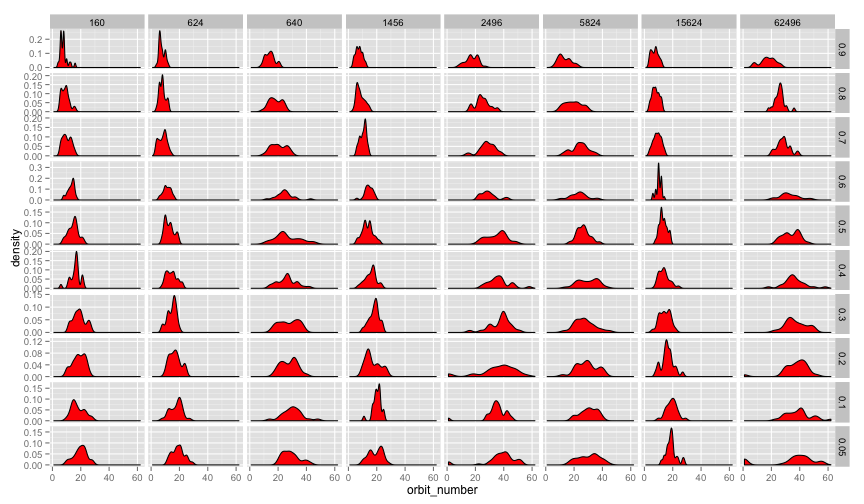
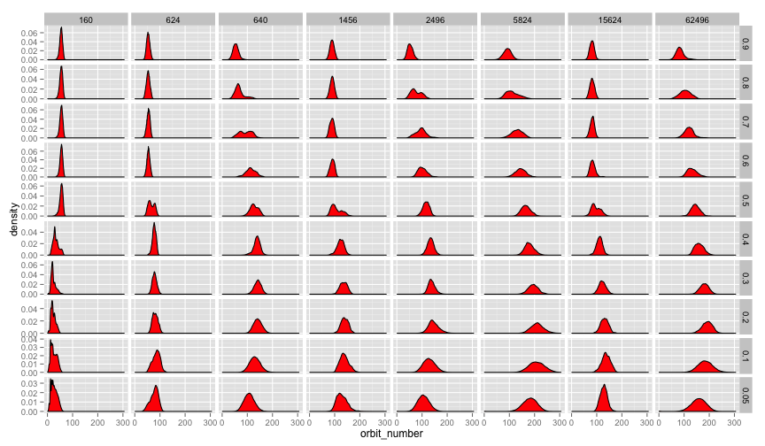
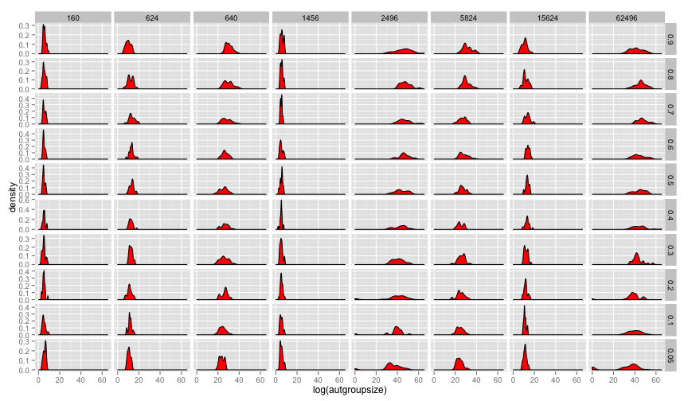
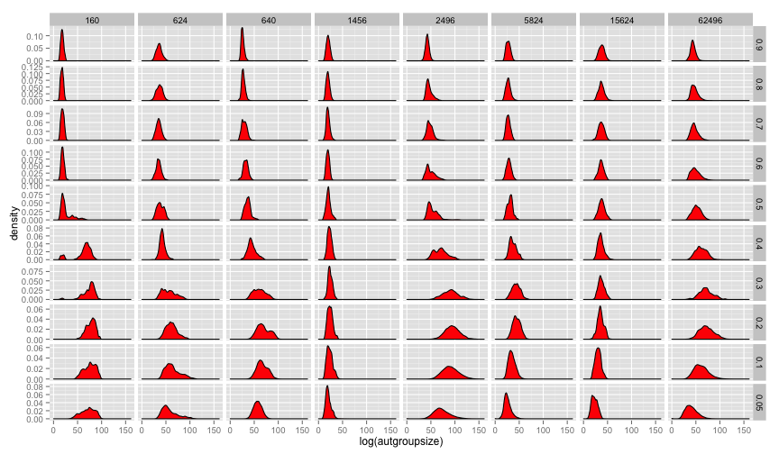

## Orbit Number and |Aut(G)|:  How Much Symmetry? ##

Without innovation:


```r

p <- ggplot(saa12finalnoinnov, aes(x = orbit_number)) + geom_density(fill = "red")
p + facet_grid(learning_rate ~ size_trait_space, scale = "free_y")
```

 


And with innovation:


```r

p <- ggplot(saa12finalinnov, aes(x = orbit_number)) + geom_density(fill = "red")
p + facet_grid(learning_rate ~ size_trait_space, scale = "free_y")
```

 


Aut(g) first without innovation:


```r

p <- ggplot(saa12finalnoinnov, aes(x = log(autgroupsize))) + geom_density(fill = "red")
p + facet_grid(learning_rate ~ size_trait_space, scale = "free_y")
```

 


And with innovation:


```r

p <- ggplot(saa12finalinnov, aes(x = log(autgroupsize))) + geom_density(fill = "red")
p + facet_grid(learning_rate ~ size_trait_space, scale = "free_y")
```

 


