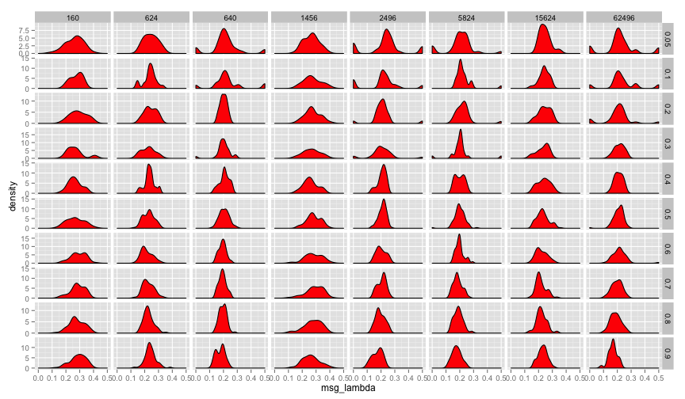
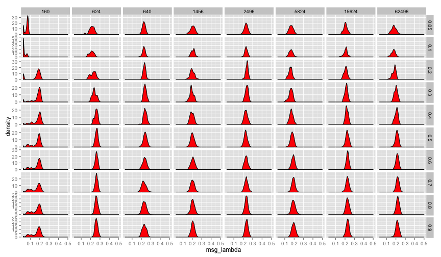
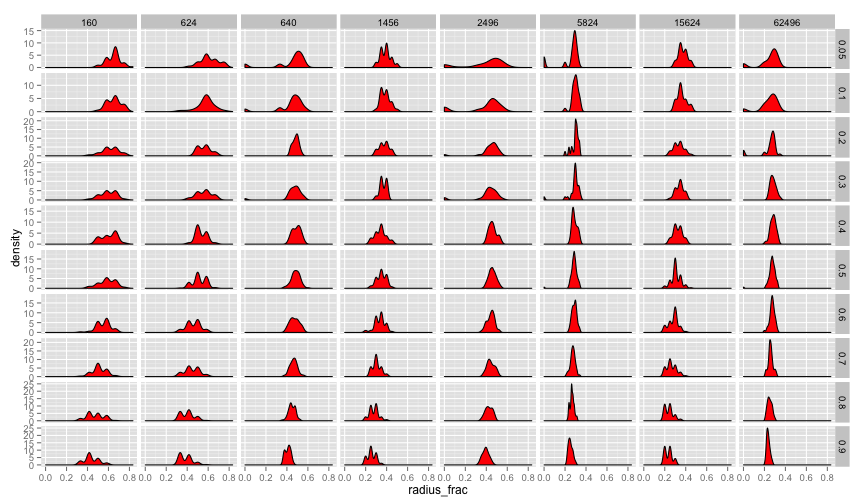
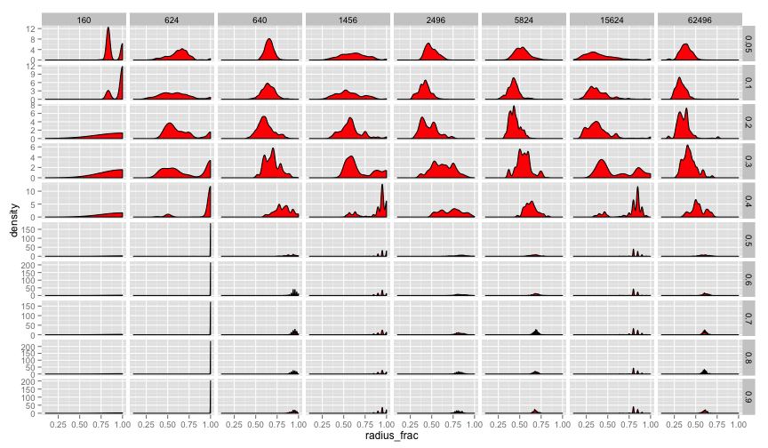
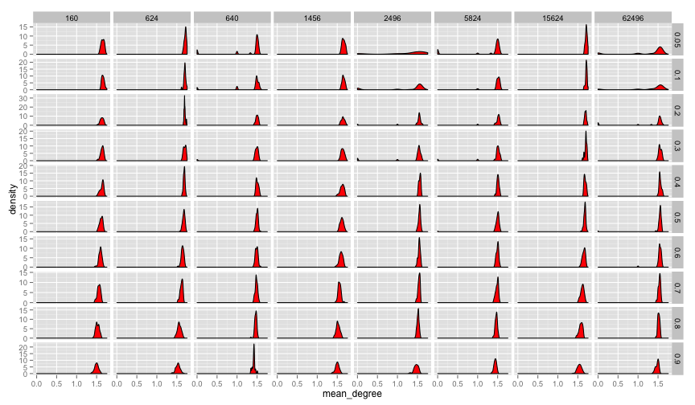
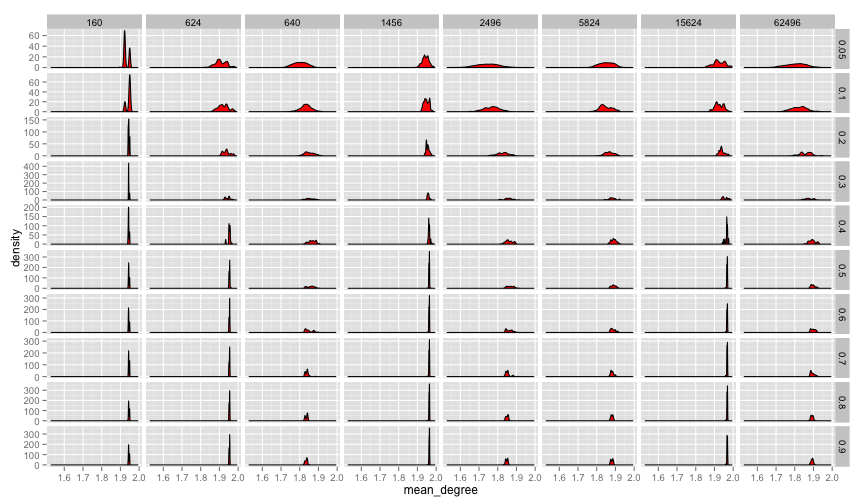

## Lambda ##

Without innovation:


```r

p <- ggplot(saa12finalnoinnov, aes(x = msg_lambda)) + geom_density(fill = "red")
p + facet_grid(learning_rate ~ size_trait_space, scale = "free_y")
```

 


And with innovation:


```r

p <- ggplot(saa12finalinnov, aes(x = msg_lambda)) + geom_density(fill = "red")
p + facet_grid(learning_rate ~ size_trait_space, scale = "free_y")
```

 


## Radius ##


Without innovation:


```r

p <- ggplot(saa12finalnoinnov, aes(x = radius_frac)) + geom_density(fill = "red")
p + facet_grid(learning_rate ~ size_trait_space, scale = "free_y")
```

 


And with innovation:


```r

p <- ggplot(saa12finalinnov, aes(x = radius_frac)) + geom_density(fill = "red")
p + facet_grid(learning_rate ~ size_trait_space, scale = "free_y")
```

 


## Mean Degree ##

Without innovation:


```r

p <- ggplot(saa12finalnoinnov, aes(x = mean_degree)) + geom_density(fill = "red")
p + facet_grid(learning_rate ~ size_trait_space, scale = "free_y")
```

 


And with innovation:


```r

p <- ggplot(saa12finalinnov, aes(x = mean_degree)) + geom_density(fill = "red")
p + facet_grid(learning_rate ~ size_trait_space, scale = "free_y")
```

 


