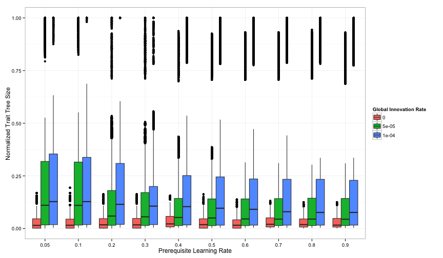
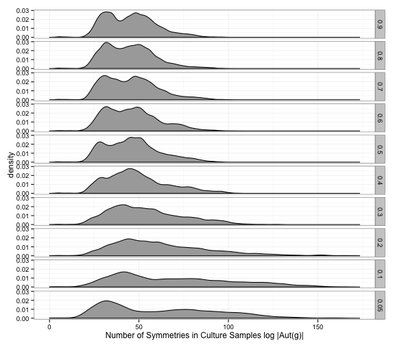
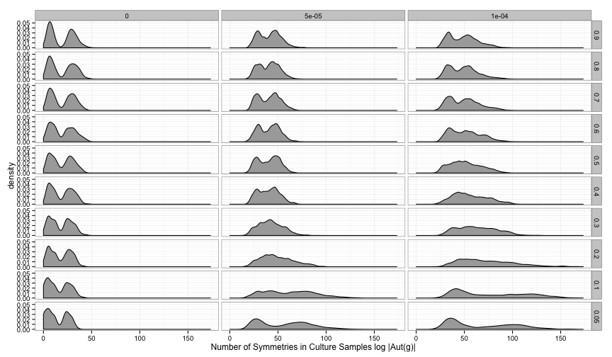
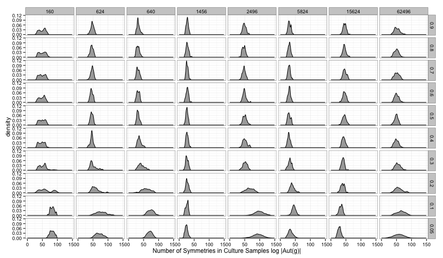

# Density Plots #


```r

p <- ggplot(data = saa12full, aes(y = remaining_density, x = factor(learning_rate), 
    fill = factor(innovation_rate))) + ylab("Normalized Trait Tree Size") + 
    xlab("Prerequisite Learning Rate") + labs(fill = "Global Innovation Rate")
p + geom_boxplot(notch = FALSE)
```

 


```r
p <- ggplot(data = saa12full, aes(x = log(autgroupsize))) + xlab("Number of Symmetries in Culture Samples log |Aut(g)|") + 
    geom_density(fill = "darkgrey")
p + facet_grid(learning_rate ~ ., as.table = FALSE)
```

 


```r
p <- ggplot(data = saa12full, aes(x = log(autgroupsize))) + xlab("Number of Symmetries in Culture Samples log |Aut(g)|") + 
    geom_density(fill = "darkgrey")
p + facet_grid(learning_rate ~ innovation_rate, as.table = FALSE)
```

 

```r
ggsave("../paper/figure/autgroupsize-by-learning-by-innovation.pdf", dpi = 300)
```


```r
p <- ggplot(data = saa12highinnov, aes(x = log(autgroupsize))) + xlab("Number of Symmetries in Culture Samples log |Aut(g)|") + 
    geom_density(fill = "darkgrey")
p + facet_grid(learning_rate ~ size_trait_space, as.table = FALSE)
```

 

```r
# ggsave('../paper/figure/autgroupsize-by-learning-by-innovation.pdf',
# dpi=300)
```

