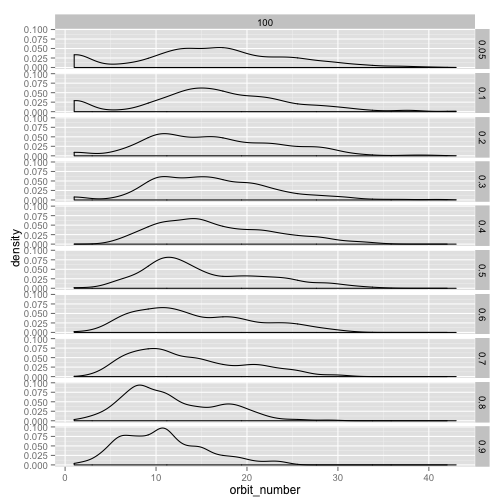
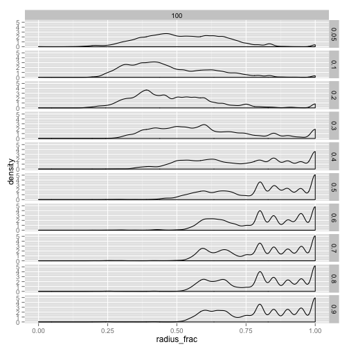
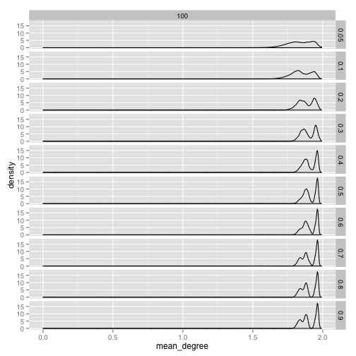
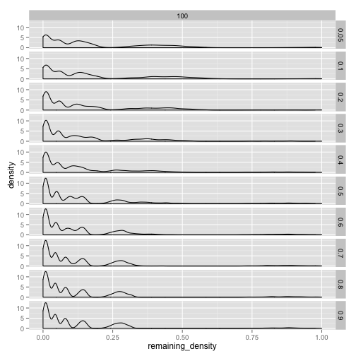
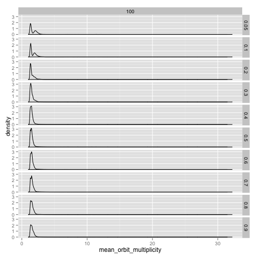

# SAA-2, SAA-3, SAA-4, SAA-7 EDA:  Population Size and Learning Rate #


Is there a systematic relationship between the number of culture regions in a sample and the learning rate? 


```r
qplot(num_culture_regions, data = region_count, geom = "density", binwidth = 2) + 
    facet_grid(learning_rate ~ sample_time)
```

 


At this stage, I'm doing some simple densities to see where there is variation across the paramter space.  Orbit number seems to have some variation.  With higher learning rate, we lose the mode at 1 and 2, and the distribution seems to shift to the right slightly with high learning rate and larger population size.  


```r
qplot(orbit_number, data = saa_full_combined, geom = "density", binwidth = 2) + 
    facet_grid(learning_rate ~ population_size)
```

 


It would be interesting to know, however, why there's a mode near 1 and 2.  This should mean an extremely symmetric tree, but also very shallow, because each hierarchical level is in its own orbit.  So a mode at 2 is basically a set of "corollas," trees with a root and just leaves below that.  This could mean, at small population sizes especially and low learning rates, that convergence occurs before the system "mixes" -- i.e., that these are initialization trait trees that aren't being modified before convergence.  They're going away with higher learning rates even in the small population because there's a decent likelihood that you'll attach *something* to an initialized graph.  

Moving on to the log of automorphism group size, without any normalization:


```r
qplot(log(autgroupsize), data = saa_full_combined, geom = "density", binwidth = 2) + 
    facet_grid(learning_rate ~ population_size)
```

 


The hints of bimodality are very interesting, as is the sense that the distribution is spreading with population size and learning rate.


```r
qplot(msg_lambda, data = saa_full_combined, geom = "density", binwidth = 0.05) + 
    facet_grid(learning_rate ~ population_size)
```

```
## Error: 'where' is missing
```


Lambda is a statistic which measures the fraction of vertices that belong to "non-trivial" orbits -- i.e., orbits with multiplicities greater than one.  There seems to be little interesting variation here, except that the modes near 0 and 1 might again by initialization effects.  


```r
qplot(mem_beta, data = saa_full_combined, geom = "density", binwidth = 0.05) + 
    facet_grid(learning_rate ~ population_size)
```

```
## Error: 'where' is missing
```


Beta (here, calculated with n-1! as the denominator) is the n-th root of the ratio of the automorphism group order to the maximally symmetric automorophism group (a tree with n-1 leaves).  A better solution is to normalize against the starting tree for each configuration, in log space, but I don't have that in this data set yet.  This isn't terribly interesting, since the resulting trait trees are all very similar in many respects.  


```r
qplot(radius_frac, data = saa_full_combined, geom = "density", binwidth = 0.05) + 
    facet_grid(learning_rate ~ population_size)
```

 


Mean degree:


```r
qplot(mean_degree, data = saa_full_combined, geom = "density", binwidth = 0.05) + 
    facet_grid(learning_rate ~ population_size)
```

 


Remaining density:


```r
qplot(remaining_density, data = saa_full_combined, geom = "density", binwidth = 0.01) + 
    facet_grid(learning_rate ~ population_size)
```

 


mean_orbit_multiplicity:


```r
qplot(mean_orbit_multiplicity, data = saa_full_combined, geom = "density", binwidth = 0.5) + 
    facet_grid(learning_rate ~ population_size)
```

 


## Possible Next Steps ##

1.  Do some simulations at much higher learning rates for prerequisites, to see if there is a qualitatively different result?  This goes to Sterelny's argument that structuring the learning environment for high-fidelity learning is what has a major impact on cumulative culture.  


## Longer Term Issues ##

1.  Even with an Axelrod model, it seems like there needs to be a "burn-in" period so we can make sure we're not looking at results from convergence that happens too quickly to get rid of the initialization data.  
