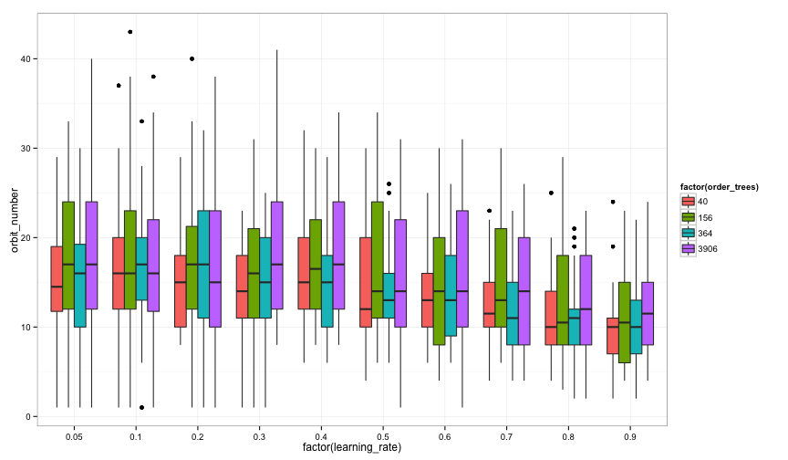
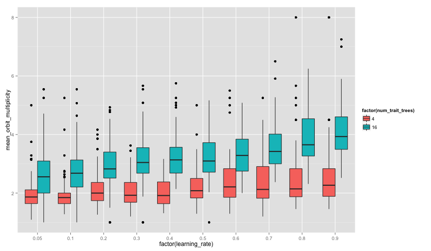
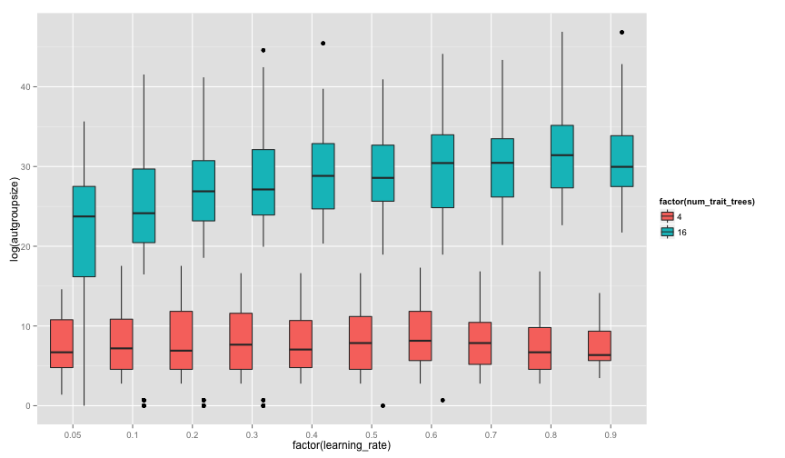
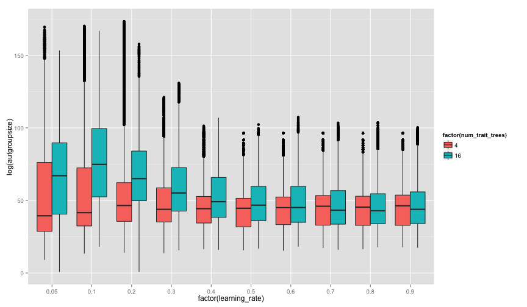
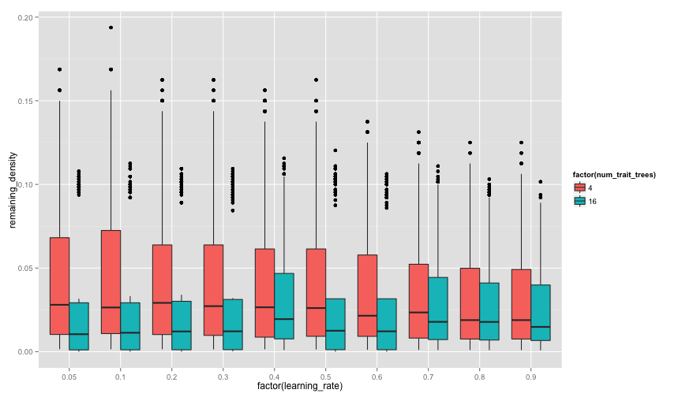
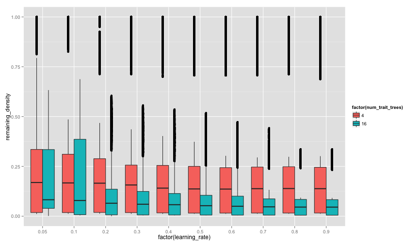
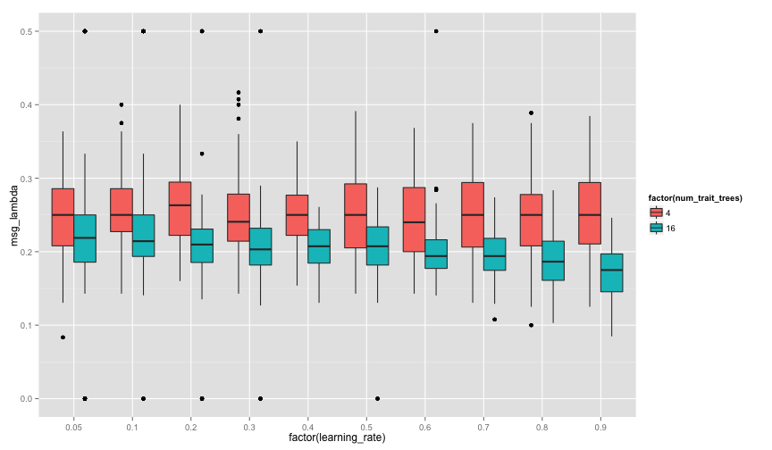
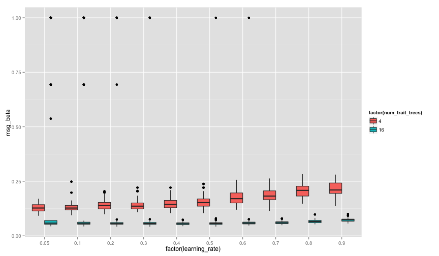
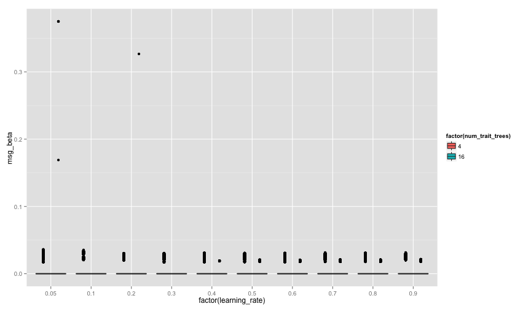

# SAA-2, SAA-3, SAA-4, SAA-7 EDA:  SSS Boxplots #


To start, I'm looking just at the size 100 population, and the "smallest" trait trees, $r=3, h=3$, and contrasting "small state spaces" with 4 trait trees with larger state spaces with 16 trees.  

## Orbit Number ##

With no innovation rate -- just copying and learning of prerequisites:


```r

p <- ggplot(data = smallstate100, aes(y = orbit_number, x = factor(learning_rate), 
    fill = factor(num_trait_trees)))
p + geom_boxplot(notch = FALSE)
```

 


Hmm.  Through learning rates of 0.6, the means basically overlap each other's interquartile range.  At higher learning rates, the number of distinct orbits declines.  In theory, this means that the trait graphs might be converging towards the original trait trees.  Let's see that with a positive noise/innovation rate:


```r

p <- ggplot(data = smallstate100innov, aes(y = orbit_number, x = factor(learning_rate), 
    fill = factor(num_trait_trees)))
p + geom_boxplot(notch = FALSE)
```

 


## Orbit Multiplicity ##

This should be accompanied by the orbit multiplicity going up, towards the average one would see in the original balanced tree.  With no innovation rate -- just copying and learning of prerequisites:


```r

p <- ggplot(data = smallstate100, aes(y = mean_orbit_multiplicity, x = factor(learning_rate), 
    fill = factor(num_trait_trees)))
p + geom_boxplot(notch = FALSE)
```

 


With noise/innovation:


```r

p <- ggplot(data = smallstate100innov, aes(y = mean_orbit_multiplicity, x = factor(learning_rate), 
    fill = factor(num_trait_trees)))
p + geom_boxplot(notch = FALSE)
```

 


## Automorphism Group Size ##


```r

p <- ggplot(data = smallstate100, aes(y = log(autgroupsize), x = factor(learning_rate), 
    fill = factor(num_trait_trees)))
p + geom_boxplot(notch = FALSE)
```

 


and with innovation:


```r

p <- ggplot(data = smallstate100innov, aes(y = log(autgroupsize), x = factor(learning_rate), 
    fill = factor(num_trait_trees)))
p + geom_boxplot(notch = FALSE)
```

 


## Remaining Density of Traits ##


```r

p <- ggplot(data = smallstate100, aes(y = remaining_density, x = factor(learning_rate), 
    fill = factor(num_trait_trees)))
p + geom_boxplot(notch = FALSE)
```

 


and with innovation:


```r

p <- ggplot(data = smallstate100innov, aes(y = remaining_density, x = factor(learning_rate), 
    fill = factor(num_trait_trees)))
p + geom_boxplot(notch = FALSE)
```

 


## Radius ##


```r

p <- ggplot(data = smallstate100, aes(y = radius_frac, x = factor(learning_rate), 
    fill = factor(num_trait_trees)))
p + geom_boxplot(notch = FALSE)
```

 


and with innovation:


```r

p <- ggplot(data = smallstate100innov, aes(y = radius_frac, x = factor(learning_rate), 
    fill = factor(num_trait_trees)))
p + geom_boxplot(notch = FALSE)
```

 


## Non-trivial Orbit Fraction ##

Lambda is the fraction of vertices in a graph that belong to non-trivial orbits.  In other words, the fraction of vertices that have some symmetries in the graph.  


```r

p <- ggplot(data = smallstate100, aes(y = msg_lambda, x = factor(learning_rate), 
    fill = factor(num_trait_trees)))
p + geom_boxplot(notch = FALSE)
```

 


and with innovation:


```r

p <- ggplot(data = smallstate100innov, aes(y = msg_lambda, x = factor(learning_rate), 
    fill = factor(num_trait_trees)))
p + geom_boxplot(notch = FALSE)
```

 


## Symmetry Index ##

Beta is the ratio of the observed automorphism group size to the order of the symmetric group S_n of the same order (i.e., the maximally symmetric graph with the same number of vertices, or $n!$)


```r

p <- ggplot(data = smallstate100, aes(y = msg_beta, x = factor(learning_rate), 
    fill = factor(num_trait_trees)))
p + geom_boxplot(notch = FALSE)
```

 


and with innovation:


```r

p <- ggplot(data = smallstate100innov, aes(y = msg_beta, x = factor(learning_rate), 
    fill = factor(num_trait_trees)))
p + geom_boxplot(notch = FALSE)
```

 


