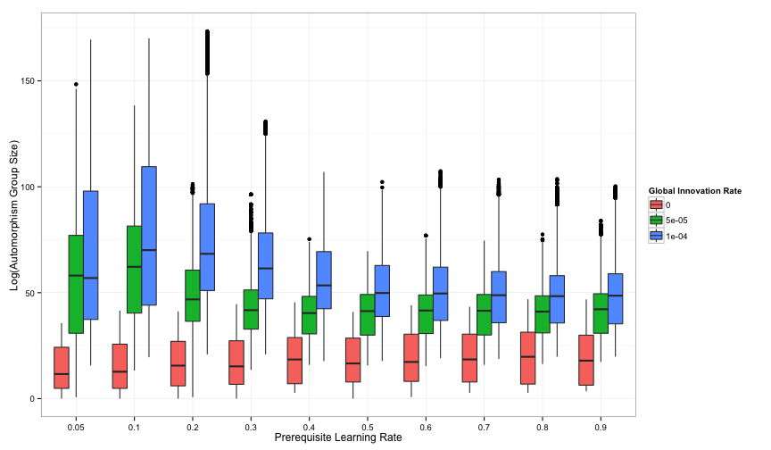

## Orbit Number ##


```r

p <- ggplot(data = saa12full, aes(y = orbit_number, x = factor(learning_rate), 
    fill = factor(innovation_rate))) + ylab("Number of Symmetry Classes (Orbits)") + 
    xlab("Prerequisite Learning Rate") + labs(fill = "Global Innovation Rate")
p + geom_boxplot(notch = FALSE)
```

 


```r

p <- ggplot(data = saa12full, aes(y = log(autgroupsize), x = factor(learning_rate), 
    fill = factor(innovation_rate))) + ylab("Log(Automorphism Group Size)") + 
    xlab("Prerequisite Learning Rate") + labs(fill = "Global Innovation Rate")
p + geom_boxplot(notch = FALSE)
```

 


