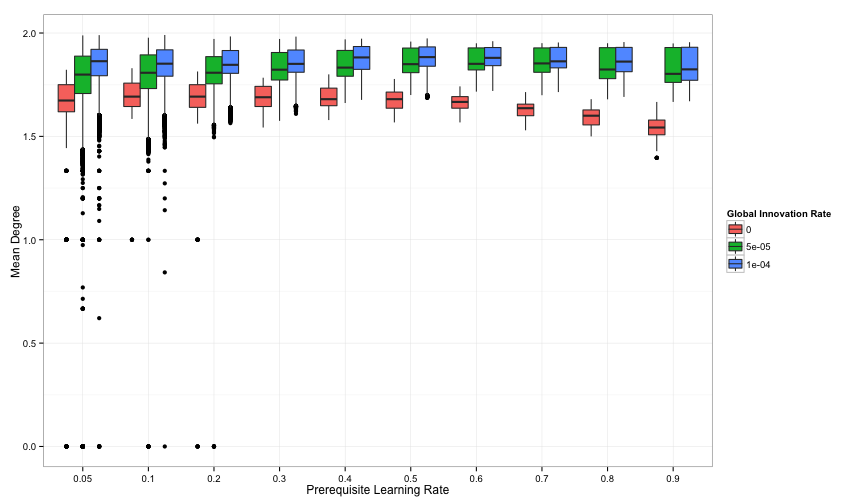
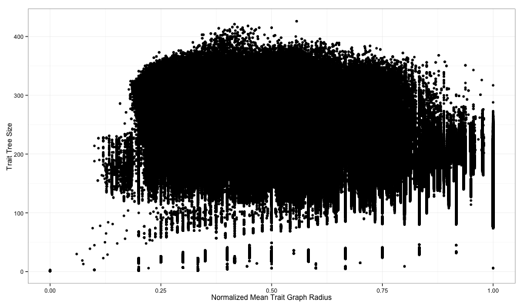

```r

p <- ggplot(data = saa12full, aes(y = radius_frac, x = factor(learning_rate), 
    fill = factor(innovation_rate))) + ylab("Normalized Mean Trait Graph Radius") + 
    xlab("Prerequisite Learning Rate") + labs(fill = "Global Innovation Rate")
p + geom_boxplot(notch = FALSE)
```

 

```r
ggsave("../paper/figure/mean-radius-by-learning-rate-innov-12.pdf", dpi = 300)
ggsave("../presentation/images/mean-radius-by-learning-rate-innov-12.pdf", dpi = 300)
```


```r

p <- ggplot(data = saa12full, aes(y = mean_degree, x = factor(learning_rate), 
    fill = factor(innovation_rate))) + ylab("Mean Degree") + xlab("Prerequisite Learning Rate") + 
    labs(fill = "Global Innovation Rate")
p + geom_boxplot(notch = FALSE)
```

 

```r
# ggsave('../paper/figure/mean-radius-by-learning-rate-innov.pdf',dpi=300)
# ggsave('../presentation/images/mean-radius-by-learning-rate-innov.pdf',dpi=300)
```


```r

p <- ggplot(data = saa12full, aes(y = order, x = factor(learning_rate), fill = factor(innovation_rate))) + 
    ylab("Trait Tree Size") + xlab("Prerequisite Learning Rate") + labs(fill = "Global Innovation Rate")
p + geom_boxplot(notch = FALSE)
```

 

```r
# ggsave('../paper/figure/mean-radius-by-learning-rate-innov.pdf',dpi=300)
# ggsave('../presentation/images/mean-radius-by-learning-rate-innov.pdf',dpi=300)
```


```r
p <- ggplot(data = saa12full, aes(y = order, x = radius_frac)) + ylab("Trait Tree Size") + 
    xlab("Normalized Mean Trait Graph Radius")
p + geom_point()
```

 

```r
p + facet_grid(learning_rate ~ innovation_rate)
```

```
## Error: No layers in plot
```


