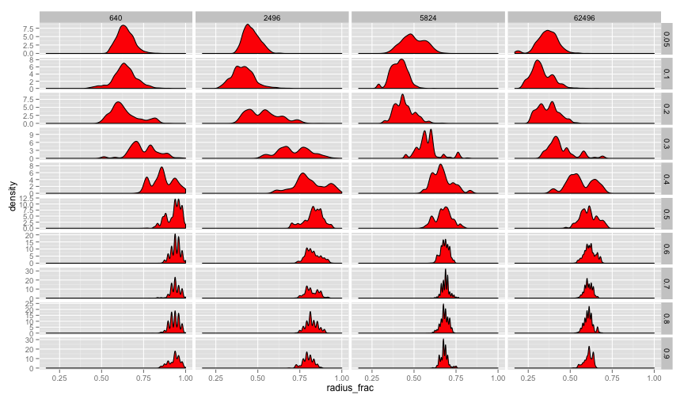

There's very definitely some interesting stuff happening with the remaining density if we look in a single size of state space -- in this case, our largest.  


```r

p <- ggplot(data = ss5516, aes(y = remaining_density, x = factor(learning_rate), 
    fill = factor(innovation_rate)))
p + geom_boxplot(notch = FALSE)
```

 

And, at a much smaller state space, we see the same shape but at a much higher fraction of remaining density.  


```r
p <- ggplot(data = ss3316, aes(y = remaining_density, x = factor(learning_rate), 
    fill = factor(innovation_rate)))
p + geom_boxplot(notch = FALSE)
```

 


## 16 Trees, Low Innovation Level ##
Now, let's just look at the state spaces with 16 trees, and with the medium level of innovation, 5e-05.  
Now let's look at the radius fraction.  Again, these all have 16 trait trees, but some of them are depth 3 and some depth 5.  So what's interesting is the ratio to the maximum.  This seems like a clear effect, but with the size of the state space, the entire pattern just shifts left, to occupy less of the state space.  


```r
p <- ggplot(ss16midinnov, aes(x = radius_frac)) + geom_density(fill = "red")
p + facet_grid(learning_rate ~ size_trait_space, scale = "free_y")
```

 


Finally let's see what's going on with symmetry measures.  First, the raw orbit number:


```r
p <- ggplot(ss16midinnov, aes(x = orbit_number)) + geom_density(fill = "red")
p + facet_grid(learning_rate ~ size_trait_space, scale = "free_y")
```

 


And now the lambda function:


```r
p <- ggplot(ss16midinnov, aes(x = msg_lambda)) + geom_density(fill = "red")
p + facet_grid(learning_rate ~ size_trait_space, scale = "free_y")
```

 


And now the automorphism group size:


```r
p <- ggplot(ss16midinnov, aes(x = log(autgroupsize))) + geom_density(fill = "red")
p + facet_grid(learning_rate ~ size_trait_space, scale = "free_y")
```

 


How does the final tree size compare?  


```r
p <- ggplot(ss16midinnov, aes(x = order)) + geom_density(fill = "red")
p + facet_grid(learning_rate ~ size_trait_space, scale = "free_y")
```

 


## Number of Cultural Regions ##

Here, we take the subset of data which has 16 trait trees, and innovation rate of 5e-05, and do the unique cultural solutions aggregation.  Then, we can look at the results faceted by the overall size of the state space, and the learning rate.  


```r

p <- ggplot(ss16mid_region_count, aes(x = num_culture_regions)) + geom_density(fill = "red")
p + facet_grid(learning_rate ~ size_trait_space, scale = "free_y")
```

 

```r

```


```r

p <- ggplot(ss16mid_region_count_noinnov, aes(x = num_culture_regions)) + geom_density(fill = "red")
p + facet_grid(learning_rate ~ size_trait_space, scale = "free_y")
```

 

```r

```


ss16mid_region_count_noinnov


